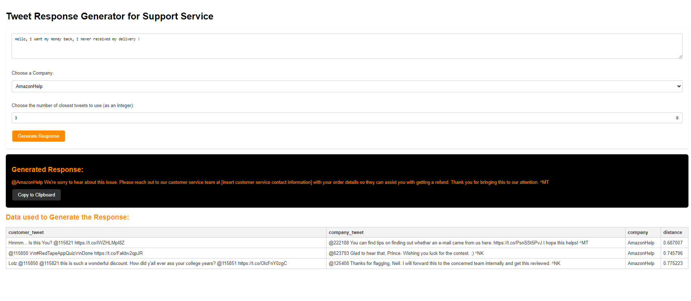

# Flask Application and RAG Backend Implementation

## Introduction

This documentation provides an overview of the backend operations for a Flask application designed to generate responses for customer service interactions. Leveraging the Retrieval Augmented Generation (RAG) approach, the application integrates OpenAI's API for natural language processing and `chromadb` for efficient vector storage and retrieval. The backend illustrates how embeddings and cosine similarity measures can enhance the relevance and contextuality of generated responses.

## Project Structure

- **Flask App**: The main script initializing the Flask web server, defining routes, and handling requests for generating customer service responses.
- **Configuration Management**: Utilizes `configparser` to manage and access the OpenAI API key from a configuration file securely.
- **Data Preparation**: Involves loading and preprocessing customer tweet data stored in a CSV file, readying it for embedding and retrieval operations.
- **ChromaDb Integration**: Demonstrates the process of creating a collection in ChromaDb, computing embeddings for customer tweets, and storing these embeddings along with metadata for future retrieval.
- **Retrieval Augmented Generation (RAG)**: Outlines the method for querying the ChromaDb collection to find the closest historical tweets based on cosine similarity of embeddings, subsequently integrating these findings into prompts for response generation with OpenAI's GPT model.

## Models

- **OpenAI GPT**: Used for generating responses to customer queries by formulating prompts that include contextually similar historical interactions.
- **ChromaDb Embeddings**: Employs `chromadb`'s embedding functions to convert tweet text into vector embeddings, which are then used for querying similar historical interactions.
- **Cosine Similarity**: A measure used to identify the closest matches in the database by comparing the cosine angle between the query and stored embeddings.

## Data Overview

The project uses a dataset of customer tweets, including company responses, to simulate a real-world customer service scenario. This dataset is preprocessed and utilized to populate the ChromaDb collection, serving as the foundation for the RAG system.

## Front End 

## Conclusion

By combining state-of-the-art NLP models with efficient vector storage and retrieval systems, the backend setup for this Flask application showcases a sophisticated approach to automating customer service responses. The integration of RAG into the response generation process ensures that replies are not only contextually relevant but also maintain a consistent tone and style, reflective of previous successful interactions.

